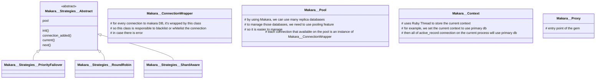

Gem link: https://github.com/instacart/makara  
This note is based on this commit https://github.com/instacart/makara/commit/30b01111fa02ee5983007236c50de864b4a5ebcd

# Summary

Makara is a Gem to route an ActiveRecord query to be sent to Primary or Replica database  
It wraps ActiveRecord connection, overrides the methods  

```ruby
  @proxy.class.hijack_methods.each do |meth|
    method_call = RUBY_VERSION >= "3.0.0" ? "public_send(#{meth.inspect}, ...)" : "#{meth}(*args, &block)"

    extension << <<~RUBY
      def #{meth}(#{args})
        _makara_hijack do |proxy|
          if proxy
            proxy.#{method_call}
          else
            super
          end
        end
      end
    RUBY
end
```

hijacked methods are:

* :execute
* :exec_query
* :exec_no_cache
* :exec_cache
* :transaction

# What I've learned

1. Main ActiveRecord's methods are above hijacked methods, even for all adapters.
2. Ruby's `|=` assignment operator. Example usage:

```ruby
   self.hijack_methods |= method_names
```
it means Bitwise OR assignment.

```ruby
x |= y # is the same as 
x = x | y
```

```
irb(main):001:0> as = [3,2]
=> [3, 2]
irb(main):003:0> as |= [4]
=> [3, 2, 4]
irb(main):004:0> as
=> [3, 2, 4]
irb(main):005:0> as |= [2]
=> [3, 2, 4]
irb(main):006:0> as
=> [3, 2, 4]
irb(main):007:0> as |= [1]
=> [3, 2, 4, 1]
```
so it will make a unique array

3. asdasd

# Diagram


